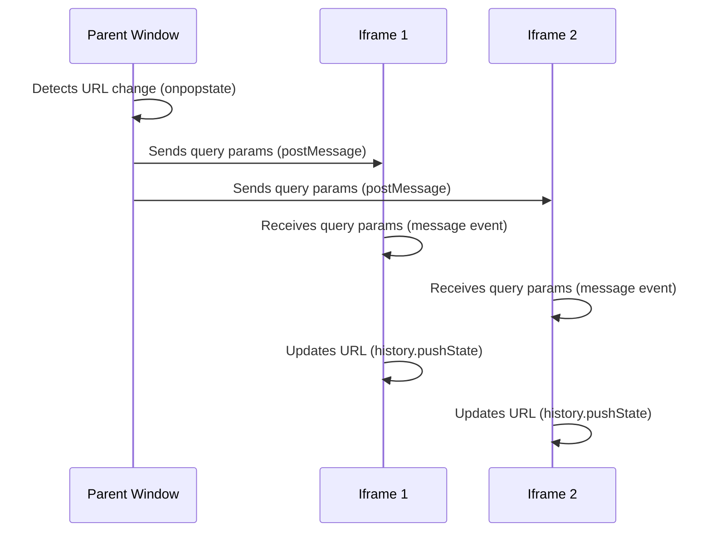

# My Astro App

This is a sample Astro app that demonstrates the usage of components and Cypress
component tests.

## Iframe Communication



```javascript
// Parent window (shell)
window.onpopstate = function (event) {
  var queryParams = window.location.search
  var iframes = document.getElementsByTagName('iframe')

  for (var i = 0; i < iframes.length; i++) {
    iframes[i].contentWindow.postMessage(queryParams, '*')
  }
}
```

```javascript
// Child iframe
window.addEventListener(
  'message',
  function (event) {
    var queryParams = event.data
    var newUrl = window.location.pathname + queryParams
    history.pushState({}, '', newUrl)
  },
  false
)
```

## Project Structure

```
my-astro-app
├── src
│   ├── components
│   │   └── MyComponent.astro
│   └── pages
│       └── index.astro
├── public
├── tests
│   └── cypress
│       ├── integration
│       │   └── MyComponent.spec.js
│       └── support
│           └── commands.js
├── cypress.json
├── package.json
└── README.md
```

## Files

- `src/components/MyComponent.astro`: This file defines the `MyComponent`
  component using Astro syntax.

- `src/pages/index.astro`: This file serves as the entry point for the
  application. It imports and uses the `MyComponent` component.

- `public`: This directory is used to store static assets that will be served by
  the Astro app.

- `tests/cypress/integration/MyComponent.spec.js`: This file contains Cypress
  component tests for the `MyComponent` component.

- `tests/cypress/support/commands.js`: This file contains custom Cypress
  commands that can be used in the component tests.

- `cypress.json`: This file is the configuration file for Cypress.

- `package.json`: This file lists the dependencies and scripts for the project.

- `README.md`: This file contains the documentation for the project.

## Getting Started

To run the Astro app and execute the component tests, follow these steps:

1. Install the dependencies by running `npm install`.

2. Start the Astro development server by running `npm run dev`.

3. To run the component tests, use the Cypress test runner by running
   `npm run test`.
